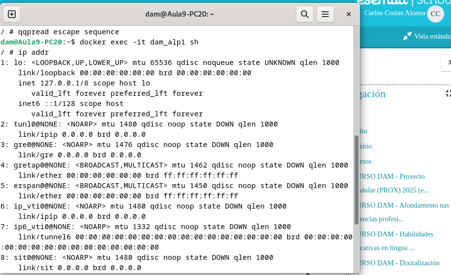
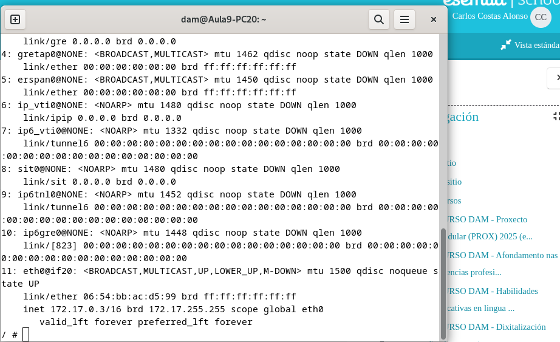

## Tarea 03

1. Descarga la imagen "alpine" sin arrancarla y comprueba que está en tu equipo.

Una vez instalado Docker, descargamos la última versión estable de Alpine Linux desde el registro oficial de Docker Hub (el repositorio público de imágenes Docker) con "pull":

````
docker pull alpine
````

Ejemplo en terminal:


2. Crea un contenedor sin ponerle nombre. ¿está arrancado? Obtén el nombre

Creamos un nuevo contenedor basado en la imagen Alpine Linux (docker run alpine), lo ejecutamos en segundo plano y lo preparamos para que pueda usarse de forma interactiva.

-d: el contenedor se ejecuta en segundo plano.

-i: mantiene la entrada estándar abierta. Esto permite que luego puedas ejecutar comandos dentro del contenedor.

-t: asigna una terminal al contenedor.
````
docker run -dit alpine
````

Para ver los contenedores en ejecución:
````
docker ps
````

Para obtener solo el nombre de los mismos:
````
docker ps --format "{{.Names}}"
````

Ejemplo en terminal:


3. Crea un contenedor con el nombre 'dam_alp1'. ¿Como puedes acceder a él?

Añadimos un "--name".

````
docker run -dit --name dam_alp1 alpine
````

Para acceder al contenedor, abrimos una consola interactiva (sh) dentro del contenedor llamado dam_alp1 que ya está en ejecución. El contenedor se ejecuta en primer plano (la consola se “mete” directamente dentro del contenedor):
````
docker exec -it dam_alp1 sh
````


Ejemplo en terminal (olvidé capturar el primer comando del apartado):




4. Comprueba que ip tiene y si puedes hacer un ping a google.com.

Comprobar ip (dentro del contenedor). En este caso, sería 127.17.0.3:

````
ip addr
````

Ping con google.com (dentro del contenedor):

-c 4: envía 4 paquetes y se detiene automáticamente. Si funciona, veremos respuestas con el tiempo de ida y vuelta (ms).

````
ping -c 4 google.com
````

Ejemplo en terminal:




5. Crea un contenedor con el nombre 'dam_alp2'. ¿Puedes hacer ping entre los contenedores?

Creamos el contenedor dam_alp2. "Sleep infinity" mantiene el contenedor activo, si no este se detiene:
````
docker run -dit --name dam_alp2 alpine sleep infinity
````

A continuación comprobamos la ip de los contenedores con "ip addr" dentro de cada contenedor. Luego, accedemos a uno de ellos (dam_alp1) y hacemos ping al otro (dam_alp2):
````
docker exec -it dam_alp1 sh
ping -c 4 (ip de dam_alp2)
````


6. Sal del terminal, ¿que ocurrió con el contenedor?

Todos los contenedores siguen en ejecución, ya que los hemos creado con la opción -d (detached mode), que ejecuta el contenedor en segundo plano.


